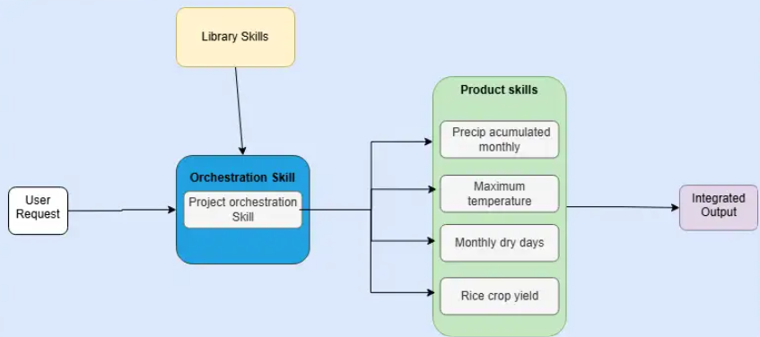

# Climate Data Hub Skills — AI Skills for Climate & Agriculture Research

A curated collection of [Claude Code](https://claude.ai/code) skills for geospatial data processing
in agriculture and climate change research. Each skill turns a natural-language request into a
ready-to-run workflow — from downloading raw climate rasters to building spatial datacubes and
extracting agronomic indicators.

📖 **Documentation site:** [cgiar-climate-data-hub.github.io/skills](https://cgiar-climate-data-hub.github.io/skills/skills/climate-dashboard/)

---

## What are skills?

Skills are domain-specific instruction sets loaded into Claude Code. When you describe what you need,
Claude reads the relevant skill and acts as a specialist — calling the right APIs, writing correct
code, and following established workflows. You don't need to know the tool names or parameters.

Skills live in `skills/`. Install or update them via Claude Code's skill system.



---

## Skills catalog

| Skill | Domain | What it does |
|-------|--------|--------------|
| [`climate-data-download`](#climate-data-download) | Data ingestion | Downloads CHIRPS, CHIRTS-ERA5, AgERA5, and NASA POWER climate data for any country or bounding box |
| [`geospatial-cube-processor`](#geospatial-cube-processor) | Spatial processing | Clips rasters to admin boundaries, stacks multi-source datasets, and computes zonal statistics |
| [`notebook-plots`](#notebook-plots) | Visualization | Writes Plotly time-series and choropleth charts into an existing Jupyter notebook; also exports a standalone Plotly HTML |
| [`climate-dashboard`](#climate-dashboard) | Visualization | Builds a self-contained interactive HTML dashboard (KPI cards, Chart.js charts, data table) from a climate CSV or NetCDF — no server needed |
| [`gcf-pipeline`](#gcf-pipeline) | End-to-end pipeline | Full download → process → notebook + dashboard workflow in one conversation |
| [`cdh-metadata`](#cdh-metadata) | Metadata authoring | Inspects a geospatial file and generates a valid YAML metadata record following the CGIAR Climate Data Hub standard |

---

## climate-data-download

**Skill path:** `skills/climate-data-download/`

Downloads climate and agrometeorological data from multiple sources. You say what variable and region
you need; the skill routes each variable to the correct source, shows you the plan, and downloads
in sequence.

**Supported sources and variables:**

| Variable | Source | Notes |
|----------|--------|-------|
| Precipitation | CHIRPS v3 | Daily 0.05°, 1981–present |
| Tmax / Tmin | CHIRTS-ERA5 | Daily 0.05°, 1983–present |
| Solar radiation | NASA POWER | S3 Zarr, no API key, 1981–2029 |
| Daily mean RH | NASA POWER | S3 Zarr |
| Hourly RH (06/09/12/15/18 UTC) | AgERA5 | CDS API key required |
| Wind speed, VPD, Ref. ET, dew point | AgERA5 | CDS API key required |

**Powered by:** [`aggeodata`](https://github.com/anaguilarar/aggeodata)

**Example:**

```
User: I need 6 AM relative humidity and reference ET for the Ashanti region of Ghana,
      January–June 2021. Output to D:/data/ashanti

Skill: Here's what I'll download (all via AgERA5):

       | Variable    | Key                           |
       |-------------|-------------------------------|
       | RH 06:00    | relative_humidity_06          |
       | Ref. ET     | reference_evapotranspiration  |

       Region: Ashanti (admin level 1) | Period: 2021-01-01 → 2021-06-30
       CDS API key required — do you have one configured?

       Shall I proceed?
```

**Setup:**

```bash
# Install aggeodata with download + MCP extras
pip install "aggeodata[download,mcp] @ git+https://github.com/anaguilarar/aggeodata.git"

# For AgERA5: create ~/.cdsapirc with your Copernicus CDS key
# Register free at https://cds.climate.copernicus.eu/
```

---

## geospatial-cube-processor

**Skill path:** `skills/geospatial-cube-processor/`

Writes geospatial processing functions directly into your existing Python script or notebook.
Works with any gridded dataset (xarray, lat/lon, EPSG:4326) — climate, soil, elevation, or land use.

**Functions this skill can write:**

| Function | What it does |
|----------|--------------|
| `mask_to_admin` | Clip a raster to a country or admin boundary (GADM v4.1) |
| `stack_datasets` | Merge multi-source datasets onto a common grid (rioxarray reproject_match) |
| `summarize_by_admin` | Zonal statistics per admin unit → CSV (mean, sum, max, min, by month/year) |
| `export_cog` | Write Cloud Optimized GeoTIFF per variable |

**Example:**

```
User: Clip my CHIRPS dataset to Ethiopia at province level and compute
      monthly mean precipitation per province.

Skill: [writes mask_to_admin and summarize_by_admin into your notebook]

# Result:
eth_chirps = mask_to_admin(chirps, "ETH", admin_level=1)
df = summarize_by_admin(eth_chirps, boundaries, agg_method="mean",
                        temporal_freq="ME", output_csv="eth_precip_monthly.csv")
```

---

## notebook-plots

**Skill path:** `skills/notebook-plots/`

Writes Plotly charts directly into an existing Jupyter notebook and also exports a
standalone Plotly HTML file. Use this skill after data has already been downloaded and
aggregated — it takes a CSV or xarray dataset and produces publication-quality interactive
figures.

**Trigger phrases:** "plot", "chart", "visualize", "draw a map", "time series", "show results in a notebook"

**Example:**

```
User: Plot monthly solar radiation per department for Bolivia from the CSV
      at D:/tmp/bolivia_climate/summary_ME_BOL_2000_2010.csv

Skill: [adds a Plotly line chart to the active notebook, exports
        summary_ME_BOL_2000_2010.html alongside it]
```

---

## climate-dashboard

**Skill path:** `skills/climate-dashboard/`

Builds a fully self-contained interactive HTML dashboard from a climate CSV or NetCDF file.
No Jupyter, no server — just a single `.html` file that opens in any browser.

Auto-detects the right chart type from the data shape:

| Data shape | Chart produced |
|------------|---------------|
| Monthly data, no admin unit | Seasonal bar chart (Jan–Dec pattern) |
| Multi-year + admin units | Time-series line chart per region |
| Single time step + admin units | Horizontal bar comparison |
| Multiple variables | One chart panel per variable |

**Trigger phrases:** "dashboard", "HTML file", "open in browser", "interactive chart", "visualize the CSV"

**Example:**

```
User: Build a climate dashboard from D:/tmp/bolivia_climate/summary_ME_BOL_2000_2010.csv
      and save it to D:/tmp/bolivia_climate

Skill: [writes bolivia_ALLSKY_SFC_SW_DWN_WS2M_2000_2010.html with KPI cards,
        time-series charts per variable, region/year filters, and a sortable data table]
```

---

## gcf-pipeline

**Skill path:** `skills/gcf-pipeline/`

Full end-to-end pipeline orchestrator: **download → spatial processing → notebook + dashboard**
in one conversation. Use this when you want to go from a country name and date range to
ready-to-use outputs without intermediate steps.

**Example:**

```
User: Show me accumulated precipitation for Kenya for the 2021 long rains season
      (March–May) at district level.

Skill: [downloads CHIRPS, clips to Kenya admin level 2, aggregates,
        writes a Jupyter notebook with Plotly charts and a standalone HTML dashboard]
```

### Using gcf-pipeline in other AI agents

The skill works in **any AI agent that can execute Python** — not just Claude Code.
See the dedicated how-to guides for your platform:

| Platform | Audience | Guide |
|----------|----------|-------|
| **Claude Code** | Advanced users, paid Claude plan | [`docs/usage-claude-code.md`](docs/usage-claude-code.md) |
| **Antigravity** | Any user, local agent | [`docs/usage-antigravity.md`](docs/usage-antigravity.md) |
| **Codex** | Any user, OpenAI Codex | [`docs/usage-codex.md`](docs/usage-codex.md) |

All three guides share the same end-user experience: type one sentence describing what
you need, confirm the plan, and get a Jupyter notebook + HTML dashboard as output.

## cdh-metadata

**Skill path:** `.agents/skills/cdh-metadata/`

Inspects a geospatial file and generates a valid YAML metadata record following the
[CGIAR Climate Data Hub (CDH) metadata standard](https://cgiar-climate-data-hub.github.io/cdh-metadata-standard/v0.1.0/schemas/core.schema.json).
Supports GeoTIFF, NetCDF, Zarr, GeoPackage, Shapefile, FlatGeobuf, and Parquet.

**What auto-extracts from the file:**

| Extracted automatically | Always asked |
|-------------------------|-------------|
| Bounding box, CRS, spatial resolution | `id`, `title`, `description` |
| Variable names, data types, nodata | License, contact (licensor), citation / DOI |
| File size, media type | Data URLs, CDH domain |

**CDH domains:** `adaptation` · `agricultural-production` · `boundaries` · `climate` · `hydrology` · `mitigation` · `socioeconomic`

**Example:**

```
User: Create CDH metadata for D:/data/MapaForestal_2024.tif
      Honduras National Forest Map 2024, published by ICF under CC-BY-4.0.
      Contact: jgarcia@icf.gob.hn  DOI: 10.12345/forestal-2024
      Domain: boundaries

Skill: Inspected MapaForestal_2024.tif —
         bbox: [-92.04, 12.98, -83.17, 16.52]  CRS: EPSG:4326
         bands: 1  dtype: uint8  nodata: 255  size: 8.4 MB

       ID:       mapa-forestal-hn-2024
       Title:    Honduras National Forest Map 2024
       License:  CC-BY-4.0
       Spatial:  [-92.04, 12.98, -83.17, 16.52] — EPSG:4326
       Domain:   boundaries
       Output:   D:/data/mapa-forestal-hn-2024.yaml

       Does this look right? I'll generate the YAML.
```

**Setup:** Uses `rasterio`, `xarray`, and `geopandas` — no `aggeodata` required.

```bash
pip install rasterio xarray geopandas pyyaml
```

**Trigger phrases:** "create metadata for", "generate CDH metadata", "document this raster",
"write a YAML for CDH", "add my data to the Climate Data Hub", "help me fill the metadata fields"

---

## Using skills together

Skills chain naturally across a research workflow:

```
1. climate-data-download  →  fetch precipitation and temperature rasters
2. geospatial-cube-processor  →  clip, stack, compute zonal stats
3. (gcf-pipeline runs all three in one go)
```

---

## MCP server configuration

The `climate-data-download` skill requires the `aggeodata` MCP server. It is already registered
in `.claude/mcp_config.json`:

```json
{
  "mcpServers": {
    "aggeodata": {
      "command": "python",
      "args": ["-m", "aggeodata.mcp_server"],
      "description": "Download CHIRPS, CHIRTS-ERA5, AgERA5, and NASA POWER climate data."
    }
  }
}
```

---

## Contributing a new skill

Skills are created and iterated using the **skill-creator** workflow (Anthropic's
[skill-creator](https://github.com/anthropics/claude-code) skill). It handles drafting,
test cases, evaluation runs, and benchmark comparison automatically.

### Skill structure

Each skill is a folder inside `skills/` with this layout:

```
skills/<skill-name>/
├── SKILL.md          ← required: YAML frontmatter + Markdown instructions
├── scripts/          ← optional: Python/shell helpers bundled with the skill
├── references/       ← optional: reference docs loaded on demand
└── assets/           ← optional: templates, icons, static files
```

`SKILL.md` must start with YAML frontmatter:

```yaml
---
name: my-skill
description: >
  One or two sentences describing what the skill does AND when to trigger it.
  Be specific about trigger phrases so Claude picks it up reliably.
---
```

### Development workflow

1. **Open Claude Code** in the `cdh_skills/` directory and invoke the skill creator:

   ```
   /skill-creator
   ```

2. **Describe your skill** — what it should do, what inputs it takes, what it outputs.
   The skill-creator will interview you, draft `SKILL.md`, and propose 2–3 test prompts.

3. **Run evals** — the skill-creator spawns parallel test runs (with skill vs. without)
   and opens a browser viewer showing outputs side-by-side with quantitative pass rates.

4. **Review and iterate** — leave feedback in the viewer. The skill-creator rewrites
   the skill based on your comments and re-runs the evals.

5. **Open a pull request** once pass rates are satisfactory. Include:
   - The new `skills/<skill-name>/` folder
   - Updated `skills-lock.json`
   - A brief PR description of what the skill does and which evals were run

### Ideas for new skills

| Skill idea | Data source |
|------------|-------------|
| Soil data download | SoilGrids REST API |
| Crop model configuration | DSSAT, AquaCrop |
| Satellite image retrieval | Sentinel-2, HLS (NASA) |
| Climate index computation | SPEI, SPI, heat stress indices |
| Land use / LULC change | ESA WorldCover, MODIS MCD12 |
